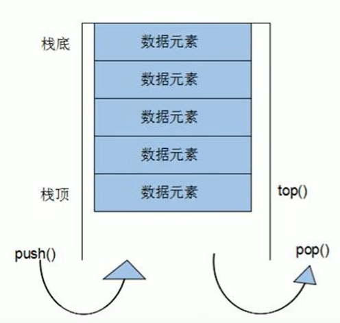

# stack容器

#### stack是一种先进后出的数据结构，只有一个出口

**栈中只有顶端的元素才可以倍外界使用，因此栈不允许有遍历行为**

栈可以返回容器是否为空（empty）也可以返回元素个数（size）

入栈push出栈pop

### 构造

**stack\<int> s**

stack(const stack &s)  拷贝构造

### 赋值

重载 =

### 数据存取

push(elem)		向栈顶添加元素

pop()			       从栈顶移除第一个元素

top()					返回栈顶元素

### 大小操作

empty()

size()		返回栈的大小