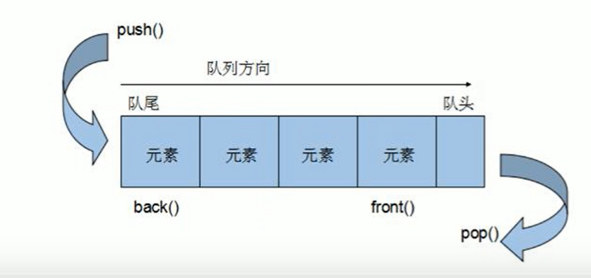

# queue容器

### 先进先出，有两个出口

==**队尾只能进数据，队头只能出数据**==

入队push出队pop

**只有队头和队尾可以被外界使用，所以队列也不允许有遍历行为**

### 构造函数

**queue\<int> q**

queue(const queue &q)  拷贝构造

### 赋值

重载 =

### 数据存取

push(elem)	从队尾添加元素

pop()

back()

front()

### 大小操作

empty()

size()

