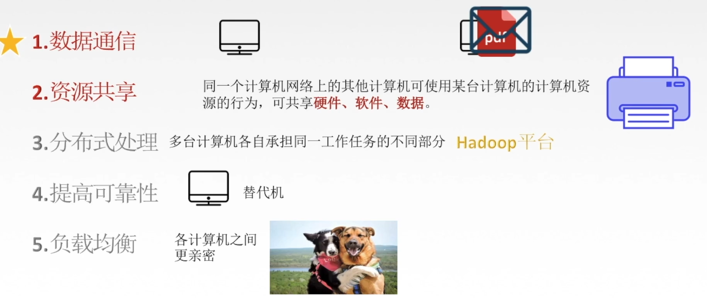
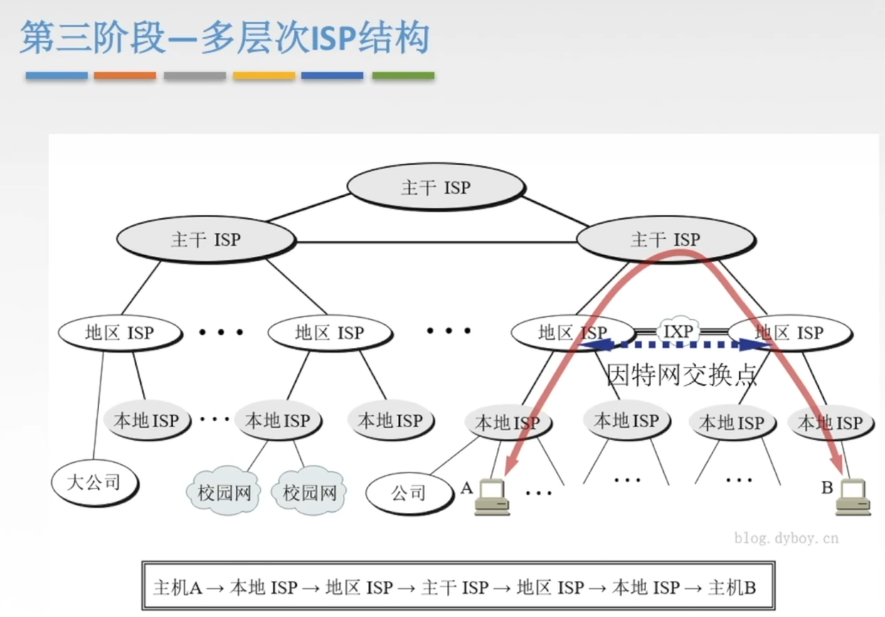
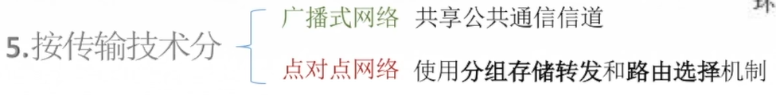
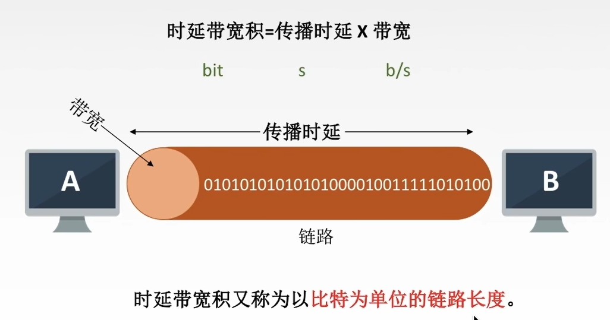
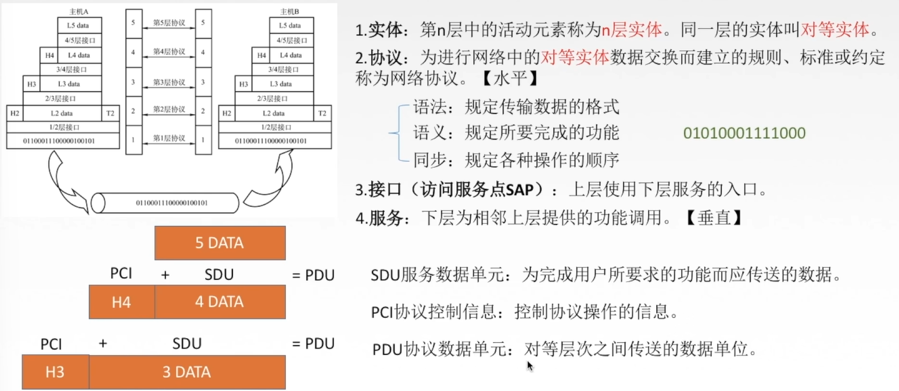

[TOC]

# 第一章 计网体系结构

## 概念

## 功能

## 组成

### **组成部分：硬件、软件、协议**

### **工作方式：分为边缘部分和核心部分**

端和端之间的通信，其实是**进程间的通信**

P2P:peer to peer 	既上传，又下载，既当客户，又当服务器

### 功能组成

## 分类

**电路交换：通信时一直占线**

报文交换和分组交换的原理：**存储转发**   一段一段地占用，不会一直占用一整段

## 小总结：

## （略）标准化工作

## （略）相关组织

## 性能指标

### 速率

### 带宽

### 吞吐量

### 时延

**高速链路：指提高了信道带宽（发送速率），其他的速率并不会变**

### 时延带宽积

**即容量**

### 往返时间RTT

**RTT越大，收到确认前**，等待时只能一直发送数据，所以**可以发送的数据越多**

### 利用率

类比堵车时行驶缓慢

## 分层结构，协议，接口，服务

**为什么要分层**

**第二层的PDU作为第三层的SDU继续向下传递**

**只有对等实体才有协议**

## OSI参考模型

**物联网属（于）会使用（的人）**

### OSI模型通信过程

**特别注意：这里数据链路层不仅加了头部，还加了尾部（只有数据链路层多加尾部）	**

因为协议用的是同一个，所以拆包就知道怎么拆	

应用层：只有连上网络才能使用的程序

表示层：用于处理在两个通信系统中交换信息的表示方式

**会话间彼此独立不会相互影响**

单工：发送和接受方恒定不变，两个人同一时间只能有一个发送一个接收

半双工：两个人都可以作为发送/接受方，但同一时间只能有一个发送一个接收

双工：两个人可以同时发送/接收

## TCP/IP模型

## 5层参考模型

### 封装与解封装

# 第二章 物理层

## 数据通信知识

